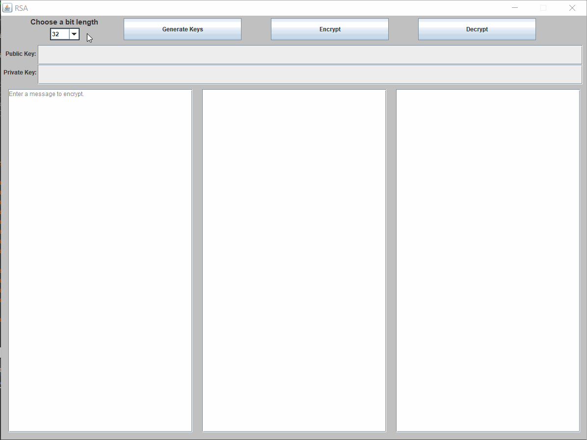
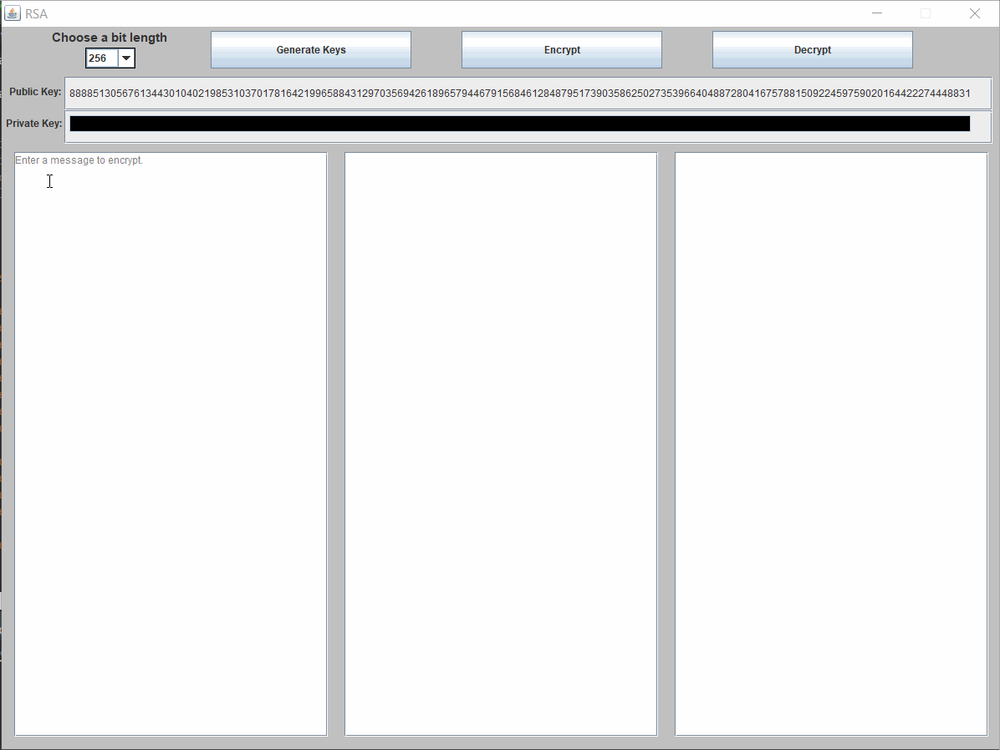

# RSA Encryption Project
## csci211-spr19-program-02

## Features

### Generate RSA Keys of Varying Bit Length
Numerical strings are generated based on the RSA algorithm using the chosen bit length for the public and private keys. A privacy bar blocks the private key until moused over.

### Encrypt and Decrypt Any Message
Any message can be entered with any number of special characters and any length; it will be encrypted, and can then be decrypted from the string of numbers representing it.

